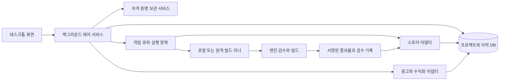

# 앱 출시·마케팅·수익화 통합 자동화 개발계획

Created: 2026-09-11
Last Updated: 2026-09-11
Description: Project-folder-driven app publishing, marketing, and monetization automation platform

## 요약

프로젝트 폴더를 등록하면 프로젝트 검수, 플랫폼별 빌드, 스토어 등록·업데이트, 광고 운영, 수익화 설정·집계와 모든 작업 이력을 하나의 앱에서 관리한다. Google Play, Apple App Store, Steam과 Google Ads, AppLovin을 필수 대상으로 삼는다. 계정은 최초 한 번 연결하고 여러 프로젝트에서 재사용하며, 정상 운영 중 인증 갱신과 연결 복구는 앱이 처리한다.

이 문서는 **개발 기준선 v1**이다. 사용자 요청은 개발계획 작성과 문서 고정이며, 이번 산출물의 완료는 요구사항·구조·작업 순서·검증 기준을 문서화하는 것이다. 후속 구현 작업은 [작업 목록](app-operations-platform-tasks.md)에 예정으로 기록한다. 진행 상황은 [작업 맥락](app-operations-platform-context.md)에 갱신하고, 방향이나 범위가 바뀌면 이 원본을 보존한 채 `app-operations-platform-plan-v2.md`부터 새 버전을 만든다.

## 현재 상태 분석

- 작업 위치: `/home/ethancl/Workspace/automation`.
- 2026-09-11 확인 시 폴더는 비어 있었으며 코드, 패키지 설정, 테스트, 기존 문서, Git 저장소가 없었다.
- 적용할 저장소 또는 상위 경로의 `AGENTS.md`는 발견되지 않았다.
- 기존 구현을 재사용할 근거가 없으므로 후속 개발을 재개할 수 있는 문서 3종과 카탈로그를 신규 작성한다.
- 개발자·광고 계정의 실제 권한, 대표 프로젝트, 빌드 장비와 라이선스는 확인하지 않았다. 공식 문서 확인과 실계정 검증을 구분한다.
- 플랫폼 조사 기준일은 2026-09-11이다. 아래 링크는 공식 문서이며, 실제 API 버전·계정 접근 권한은 Phase 2에서 재확인한다.

## 목표 상태

### 1. 고정 요구사항

| ID | 요구사항 | 완료를 판단할 동작 | 담당 단계 |
|---|---|---|---|
| R-01 | 폴더 기반 프로젝트 등록 | 폴더 선택으로 엔진·버전·타깃·기존 앱 식별자를 탐지하고 여러 프로젝트를 관리 | 3 |
| R-02 | 프로젝트 자동 검수 | 설정·의존성·서명·제출 자료·실행 검사를 수행하고 근거와 수정 방법을 제시 | 3–6 |
| R-03 | 여러 엔진과 플랫폼 빌드 | Godot, Unity, Unreal, 네이티브 Android, 네이티브 iOS의 지원 조합을 실제 빌드로 검증 | 3–6 |
| R-04 | 스토어 등록과 업데이트 | Google Play·App Store·Steam의 신규 앱 준비, 업로드, 심사·출시·업데이트 상태를 통합 관리 | 4–5 |
| R-05 | 이력 전 과정 자동 기록 | 소스 스냅샷에서 빌드·배포·광고·수익화 변경까지 원인과 결과를 연결 | 2–9 |
| R-06 | 마케팅 운영 | Google Ads·AppLovin 캠페인, 소재, 예산, 상태, 성과 조회와 변경을 제공 | 8 |
| R-07 | 수익화 운영 | 광고 단위·미디에이션, 상품·구독·판매 설정, 광고·결제·판매 수익을 관리 | 7 |
| R-08 | 최초 1회 계정 연결 | 인증 유지·갱신·재시도와 다중 프로젝트 재사용에 반복 로그인·키 입력이 없음 | 2, 9 |
| R-09 | 작업 자동 연결 | 저장한 실행 정책에 따라 검수→빌드→배포와 운영 작업을 이어서 실행 | 2–9 |
| R-10 | 사용자 개입 최소화 | 기존 정보 재사용, 관련 요청 묶음 처리, 예외 해결 후 중단 지점부터 자동 재개 | 2–9 |

단계별 출시는 구현 순서를 뜻한다. 최종 범위에서 특정 스토어·엔진·광고 플랫폼이나 수익화 관리를 제외하려면 새 계획 버전에 그 변경을 명시해야 한다. 위 표의 기능을 조회 화면만으로 완료 처리하지 않는다.

### 2. 제품 형태와 사용 흐름

이번 계획에서는 **로컬 우선 데스크톱 앱과 백그라운드 실행 서비스**를 채택한다. 사용자가 자신의 프로젝트 폴더와 설치된 개발 도구를 이용하고, 필요한 경우 한 번 연결한 다른 컴퓨터에 빌드를 맡긴다. 제품 자체의 별도 회원가입은 초기 버전에 요구하지 않는다.

1. 최초 실행: 사용할 스토어·광고·수익화 계정을 연결한다. 이미 존재하는 계정과 앱을 가져오고 읽기·쓰기·재무 권한을 함께 확인한다.
2. 최초 환경 설정: 로컬 도구를 탐지하고 필요한 빌드 장비, 서명 정보, 기본 배포 대상, 광고 운영 범위를 한 번 설정한다. 설치·라이선스 관련 조작이 필요하면 이 단계에 묶는다.
3. 프로젝트 등록: 폴더를 선택하면 식별자와 설정을 읽어 기존 스토어 앱을 매칭한다. 확정할 수 없는 매칭과 프로젝트 고유 정보만 요청한다.
4. 출시 준비: 검수와 시험 빌드를 수행하고, 기존 설명·스크린샷·가격·상품 설정을 가져온다. 프로젝트에 없는 사업자 정보나 개인정보 처리 내용은 추측해서 채우지 않는다.
5. 반복 운영: 저장한 대상·버전 규칙·트리거에 따라 빌드와 배포를 실행하고 광고·수익화 현황을 갱신한다. 계정을 다시 연결하지 않는다.
6. 예외 처리: 사용자 조작이 필요한 원인, 영향을 받는 작업, 필요한 행동을 한 알림에 모은다. 해결되면 완료된 단계를 반복하지 않고 이어서 처리한다.

필수 화면은 프로젝트 목록·요약, 프로젝트 검수, 빌드·배포, 스토어 등록 정보, 마케팅, 수익화, 전체 이력, 계정·환경 설정이다. 작업 로그와 기술 설정은 상세 화면에 두고 기본 화면에는 실행 결과와 필요한 행동을 표시한다. 기본 언어는 한국어, 원본 스토어 자료와 광고 소재는 다국어를 보존한다.

### 3. 최초 1회 연결의 계약

- 연결은 `플랫폼 + 계정/조직 식별자 + 부여된 권한` 단위다. 프로젝트는 연결 ID를 참조하고 비밀번호·키를 복사하지 않는다.
- API 접근 권한이 있는 서비스는 OAuth의 갱신 토큰, 서비스 계정, API 키, 공식 CLI의 지속 로그인 정보를 사용한다. 일반 사용자 비밀번호를 반복 전송하는 구조를 기본 인증으로 삼지 않는다.
- OAuth 로그인은 시스템 브라우저와 공급자가 지원하는 데스크톱 인증 흐름을 사용한다. 갱신은 백그라운드에서 처리하고 동시 갱신을 직렬화한다. [Google 데스크톱 OAuth](https://developers.google.com/identity/protocols/oauth2/native-app)
- 플랫폼별 자격 증명은 목적이 다를 수 있다. 예를 들어 광고 집행과 수익 보고에 서로 다른 키가 필요하면 첫 연결 화면에서 함께 등록하고 이후에는 서비스 하나로 표시한다.
- 상태는 `연결됨 / 자동 복구 중 / 권한 부족 / 사용자 조치 필요 / 연결 해제됨`으로 구분한다. API 일시 오류나 잠긴 OS 보관함을 무조건 재로그인으로 해결하지 않는다.
- 정상 갱신, 프로그램 재시작·업데이트, 프로젝트 추가, 정기 집계, 반복 빌드·업로드 때문에 외부 로그인을 다시 요구하지 않는다.
- 최초 계정 등록·사업자 확인·약관 동의, 신규 앱에 필요한 고유 정보, 공급자가 강제하는 본인 확인·재동의는 별도다. 계정 연결 1회가 신규 앱별 법적 동의를 대신하지 않는다.
- 같은 원인으로 영향을 받는 프로젝트가 여러 개여도 요청은 연결 단위로 합친다. 복구 가능한 오류는 자동으로 재시도하고 사용자 조치가 필요한 상태에서 로그인 창을 반복해서 열지 않는다.

**계정이 취소되거나 공급자가 재확인을 강제한 뒤에도 영구 무인 동작한다고 약속하지 않는다.** 이 예외는 숨기지 않되 사용자의 일상적인 인증 관리 업무를 없애는 것을 제품 품질 기준으로 둔다. 갱신 토큰도 무효화될 수 있으며, Google의 외부용 OAuth 앱이 `Testing` 상태이면 일부 기본 정보 범위를 제외한 갱신 토큰이 7일 만료 대상이므로 이 상태로 무인 운영을 검증하지 않는다. [Google 토큰 만료 조건](https://developers.google.com/identity/protocols/oauth2)

### 4. 서비스별 연동 기준과 제한

아래의 자동화 수단은 공식 문서에서 확인한 구현 근거다. 실제 계정 검증 완료 표시는 아니다. 각 기능은 `공식 API / 공식 CLI / 검증된 브라우저 절차 / 사용자 필수 조치 / 미지원 / 미검증`으로 기록한다.

| 서비스·기능 | 최초 연결 및 자동화 수단 | 계획에 반영할 조건 | 공식 근거 |
|---|---|---|---|
| Google Play 배포 | 적절한 권한의 서비스 계정 또는 OAuth, Publishing API | 기존 앱의 빌드·트랙·등록 자료 업데이트부터 검증. 최초 등록·첫 바이너리·필수 동의의 Console 절차를 별도 처리. Console 외부 변경 시 열린 edit 충돌 복구 | [인증](https://developers.google.com/android-publisher/getting_started), [배포 edit와 제한](https://developers.google.com/android-publisher/edits) |
| Google Play 재무 | 보고서 버킷 접근 권한과 Cloud Storage | 매출 추정과 정산 보고서 구분, 버킷 경로 1회 등록, 지연 도착·정정 파일 재수집 | [보고서 자동 다운로드](https://support.google.com/googleplay/android-developer/answer/6135870?hl=en) |
| App Store 배포 | App Store Connect API 키로 JWT 발급, API·Transporter 업로드 | 앱 관리, 빌드 업로드·처리, TestFlight, 버전·심사 요청을 별도 단계로 추적. 배포용 서명 인증서와 API 키는 별개 | [API 범위](https://developer.apple.com/app-store-connect/api/), [빌드 업로드](https://developer.apple.com/help/app-store-connect/manage-builds/upload-builds/) |
| Apple 서명·재무 | 역할에 맞는 팀 API 키, 서명 키·프로파일 | 개인 API 키는 프로비저닝·Sales and Finance 접근에 제한이 있으므로 요구 기능에 맞춰 첫 설정에서 검증 | [API 키 종류](https://developer.apple.com/documentation/appstoreconnectapi/creating-api-keys-for-app-store-connect-api), [재무 보고서](https://developer.apple.com/help/app-store-connect/getting-paid/download-financial-reports/) |
| Steam 빌드·출시 | 전용 빌드 계정, SteamCMD·SteamPipe 지속 로그인 | 최초 Steam Guard 인증 후 갱신되는 로그인 설정을 보존. 테스트 브랜치 업로드와 출시된 앱의 공개 빌드 전환은 별도이며 후자에 휴대전화·모바일 확인이 요구될 수 있음 | [SteamPipe와 지속 로그인](https://partner.steamgames.com/doc/sdk/uploading) |
| Steam 매출 | Financial API Group의 별도 Web API 키 | 업로드 계정 권한만으로 매출 접근을 가정하지 않음. 판매·환불 원천 필드와 갱신 시점 확인 | [재무 API](https://partner.steamgames.com/doc/webapi/IPartnerFinancialsService) |
| Google Ads | OAuth 또는 지원되는 서비스 계정 인증과 Google Cloud 프로젝트의 API 접근 수준 | 2026-09-09 developer token 종료 공지를 반영. 신규 연동은 Cloud 프로젝트 접근 권한 기준으로 검증하고 이전 토큰 입력을 필수 온보딩으로 만들지 않음 | [접근 체계 변경](https://developers.google.com/google-ads/api/docs/api-policy/developer-token), [시작 안내](https://developers.google.com/google-ads/api/docs/get-started/introduction) |
| AppLovin 광고 집행 | Campaign Management API 키와 광고 계정 ID | 캠페인·소재 관리 키와 보고 키를 함께 연결. 공식 안내의 허용 목록 접근 제한을 계정별로 확인 | [캠페인 관리](https://support.applovin.com/en/growth/promoting-your-apps/api/axon-campaign-management-api), [접근 제한 안내](https://support.applovin.com/en/growth/introduction/applovin-mcp) |
| AppLovin 광고 성과 | 광고 Reporting API와 Report Key | 광고비·성과를 MAX 광고 수익과 별도 수집 | [광고 보고 API](https://support.applovin.com/en/growth/promoting-your-apps/api/reporting-api) |
| AppLovin MAX 수익화 | Management Key와 Report Key | 광고 단위·미디에이션 설정과 추정 광고 수익을 각각 관리. 네트워크·작업별 API 지원 여부 확인 | [광고 단위 관리](https://support.applovin.com/en/max/advanced-features/ad-unit-management-api), [수익 보고](https://support.applovin.com/en/max/reporting-apis/revenue-reporting-api) |
| AdMob 수익화 | OAuth와 계정·앱 매핑 | 광고 단위·미디에이션 지원 작업과 네트워크/미디에이션 보고서를 분리 | [보고서](https://developers.google.com/admob/api/v1/reporting), [미디에이션 관리](https://developers.google.com/admob/api/v1/mediation-groups) |

API가 없는 화면은 작업 단위로 정책·접근 방식·안정성을 확인한 뒤 브라우저 어댑터를 작성한다. 이미 허용된 절차는 보관한 전용 세션을 재사용한다. 화면 구조가 달라지면 상태를 다시 읽고 중단하며 임의 버튼을 눌러 진행하지 않는다. CAPTCHA·2단계 인증·필수 동의는 우회하지 않고 해당 단계만 사용자에게 연결한다. 브라우저 자동화가 가능한지 검증되지 않은 기능을 완전 자동으로 분류하지 않는다.

신규 앱 생성, 스토어별 필수 설문, Steam 상점·가격 설정 등은 Phase 2의 기능별 조사표에서 반드시 다룬다. 공식 수단이 없고 브라우저 절차도 사용할 수 없다면 그 기능은 자동화 제한으로 남는다. 그런 상태에서는 전체 무인 자동화가 완성됐다고 선언하지 않는다.

### 5. 엔진·운영체제 지원 범위

| 프로젝트 | 탐지 근거 | 빌드 어댑터 | 최종 검증 대상 |
|---|---|---|---|
| Godot | `project.godot`, 내보내기 설정, 언어·엔진 버전 | headless 내보내기, 타깃별 템플릿 | Android, iOS, Steam용 Windows·macOS·Linux |
| Unity | `ProjectSettings/ProjectVersion.txt`, `Packages/manifest.json` | 설치된 Editor의 batch 실행과 버전별 빌드 진입점 | Android, iOS, Steam용 Windows·macOS·Linux |
| Unreal | `.uproject`, 엔진 연결 정보, 플러그인 | UAT의 BuildCookRun, 타깃별 도구 | Android, iOS, Steam용 Windows·macOS·Linux |
| 네이티브 Android | Gradle Wrapper, settings/build 파일, Manifest | 프로젝트의 Wrapper와 선택된 variant | Google Play용 AAB와 시험 설치용 APK |
| 네이티브 iOS | `.xcodeproj`·`.xcworkspace`, scheme·target | Xcode archive·export와 서명 | App Store·TestFlight용 iOS 빌드 |

이 표는 **개발 목표**다. 모든 엔진 버전, 언어, 플러그인, 호스트 조합의 무제한 호환을 뜻하지 않는다. 엔진 어댑터마다 대표 버전과 언어를 고정한 실제 샘플, OS, CPU 구조, SDK, 라이선스 조건을 지원표에 기록한다. Godot의 C# 등 별도 제약이 있는 조합도 구분한다.

iOS는 macOS·Xcode가 있는 러너에서 서명·빌드한다. Windows·Linux에서 관리 앱을 사용하더라도 해당 Mac을 한 번 연결해 작업을 넘긴다. Windows·macOS·Linux의 네이티브 플러그인·서명·시험 실행은 필요한 OS의 러너로 배정한다. 지원되지 않는 교차 빌드를 성공 경로로 가정하지 않는다. [Godot iOS 요건](https://docs.godotengine.org/en/stable/tutorials/export/exporting_for_ios.html), [Unreal 원격 Mac 빌드](https://dev.epicgames.com/documentation/unreal-engine/creating-remote-builds-of-unreal-engine-projects-for-ios)

엔진은 기존 설치와 프로젝트에 지정된 버전을 우선 사용한다. 필요한 버전 설치·라이선스 등록은 환경 준비에 포함하고 매 빌드마다 계정 로그인을 요구하지 않는다. 실제 CLI 인수는 해당 설치 버전의 공식 진입점으로 검증한다. [Godot CLI](https://docs.godotengine.org/en/stable/tutorials/editor/command_line_tutorial.html), [Unity CLI](https://docs.unity3d.com/6000.0/Documentation/Manual/EditorCommandLineArguments.html), [Unreal 빌드 과정](https://dev.epicgames.com/documentation/unreal-engine/build-operations-cooking-packaging-deploying-and-running-projects-in-unreal-engine), [Android CLI 빌드](https://developer.android.com/build/building-cmdline)

### 6. 구조와 기술 선택

| 영역 | 채택안 | 선택 이유·범위 |
|---|---|---|
| 데스크톱 | Electron + React + TypeScript | 폴더·프로세스·OS 보관함 접근, 세 OS의 공통 UI. Electron은 권한 있는 부분과 화면을 격리 |
| 제어 서비스 | TypeScript + 지원 중인 Node.js LTS, 사용자 백그라운드 서비스 | 화면을 닫아도 예약·집계·진행 작업 유지. 상세 런타임 버전은 착수 시 고정 |
| 실행 상태 저장 | SQLite와 WAL, 단일 제어 서비스가 소유 | 초기 단일 운영자·여러 프로젝트의 내구성 있는 큐와 이력을 간단한 배포 단위로 관리 |
| 빌드 실행 | 별도 러너 프로세스, 로컬 및 등록된 원격 장비 | 엔진 실행을 화면·계정 보관과 분리하고 OS별 빌드 처리 |
| 파일 보관 | 로컬 아티팩트 저장소, 해시·매니페스트·보존 정책 | 큰 바이너리는 DB 밖에 저장. 다른 장비로 보낼 때 필요한 스냅샷만 전송 |
| 외부 연동 | 서비스별 API·CLI 어댑터, 필요한 경우 검증된 브라우저 어댑터 | 공식 수단 우선, 기능 지원과 계정 상태를 공통 형식으로 노출 |
| 검증 | 타입·정적 검사, 핵심 로직 테스트, 실제 프로세스·DB 통합 테스트, UI 시나리오 | 구체적 명령은 패키지 엔트리포인트를 만든 뒤 기록 |

초기에는 서버 마이크로서비스·Redis·별도 사용자 계정 서버를 도입하지 않는다. 다중 조직 SaaS, 사용자별 과금, 공개 플러그인 마켓은 이번 사용자 요구에서 확정되지 않은 확장이다. 미래 확장을 이유로 초기 구조에 선행 구현하지 않는다. Tauri는 Rust와 JS 양쪽의 실행 계층이 필요하므로 이번 기준선에서는 Electron을 선택한다.



제어 서비스 한 대를 이력과 작업 소유권의 기준으로 삼는다. 원격 러너가 SQLite 파일을 네트워크로 공유하지 않는다. 원격 통신은 한 번 등록한 장비 신원과 암호화된 연결로 인증하고, 작업·프로젝트 범위를 검증한다. 네트워크 구성과 주소를 저장해 재연결에 계정 로그인을 요구하지 않는다.

화면 종료와 컴퓨터 종료는 구분한다. 컴퓨터가 꺼지거나 잠들면 그 장비의 작업은 실행되지 않는다. 계속 켜진 장비에 제어 서비스를 배치하면 UI가 닫힌 동안에도 운영한다. 제어 서비스 이전은 DB·보관함 이전과 소유권 전환을 묶어 중복 스케줄러를 막는다. 잠긴 OS 보관함에서 비밀을 읽을 수 없는 부팅 상태도 환경 준비 상태로 표시한다.

예정 코드 구조는 다음과 같다. 현재 존재하는 파일이나 실행 가능한 명령을 뜻하지 않는다.

```text
apps/desktop/                  데스크톱 화면과 제한된 IPC 연결
apps/controller/               예약, 작업 큐, 외부 연동, 이력 저장
apps/runner/                   빌드·검수·서명 작업 실행
packages/domain/               프로젝트·작업·정책·보고 데이터 계약
packages/storage/              DB 스키마와 마이그레이션
packages/credentials/          OS 보관함과 인증 갱신
packages/engines/              Godot·Unity·Unreal·Android·iOS 어댑터
packages/connectors/           Play·Apple·Steam·Ads·AppLovin·AdMob 연동
packages/inspection/           검수 규칙과 결과
packages/metrics/              매출·광고비·성과 정규화
tests/fixtures/                버전이 고정된 대표 프로젝트·응답
tests/integration/             장애·재시도·실서비스 계약 검증
tests/e2e/                     사용자 흐름 검증
docs/                          구현하면서 검증한 기능표·운영 절차
dev/                           유효 계획, 작업 목록, 진행 맥락
```

### 7. 자격 증명과 실행 경계

- 키·토큰·서명 비밀은 OS의 안전한 보관 수단으로 보호하고 DB에는 참조와 권한·만료 메타데이터를 저장한다. 로그, 텔레메트리, 오류 첨부, 소스 스냅샷에서 비밀을 제거한다.
- Electron 화면은 비밀을 직접 읽거나 임의 명령을 실행하지 않는다. IPC 요청과 프로젝트 경로를 검증하고 외부 웹페이지를 권한 있는 앱 화면으로 로드하지 않는다.
- Linux에서 안전한 보관함이 없는 경우 평문 대체 모드를 정상 연결로 취급하지 않는다. macOS 배포 앱은 일관된 서명으로 보관함 권한이 업데이트마다 재요청되지 않게 검증한다. [Electron 보관함 특성](https://www.electronjs.org/docs/latest/api/safe-storage)
- 계정/API 자격 증명은 제어 서비스에 둔다. 빌드 러너에는 필요한 파일과 작업 한정 권한만 전달한다. 서명에 필요한 비밀은 별도 서명 단계와 해당 장비의 보관함에 한정한다.
- 프로젝트의 빌드 스크립트는 코드를 실행한다. 빌드와 배포 권한의 OS 계정·프로세스 경계를 구분하고 지원되는 환경에서는 컨테이너·격리 작업 공간을 사용한다. Mac 등에서는 별도 계정·러너로 동등한 분리를 검증한다.
- 원본 폴더를 바로 수정하거나 정리하지 않는다. Git 유무와 관계없이 실행 당시 파일 목록·해시의 스냅샷을 만들고, 미커밋 변경도 포함 여부와 함께 기록한다. 엔진 변환·SDK 보완은 작업 복사본에서 수행한다.
- 연결 해제는 관련 작업을 정지하고 보관된 자격 증명을 삭제한다. 자격 증명 복구·장비 이전은 일반 데이터 백업과 구분해 OS별로 검증한다.

### 8. 실행·이력 데이터 계약

| 데이터 | 보존할 핵심 정보 |
|---|---|
| 프로젝트·배포 대상 | 폴더, 엔진 버전, 앱 식별자, 플랫폼·스토어·계정 연결, 빌드 설정, 기본 실행 정책 |
| 연결·장비 | 공급자 계정, 권한·지원 기능, 보관함 참조, 연결 상태, 러너 OS·CPU·도구·마지막 접속 |
| 소스·검수·결과물 | Git 커밋이 있으면 커밋, 변경 파일 해시, 도구 버전, 검수 규칙 버전·결과, 빌드 파일 해시·서명 정보 |
| 작업·단계·외부 효과 | 실행 ID, 단계별 시도, 입력 해시, 예정 변경, 외부 요청·결과 ID, 시작·종료 시각, 실패·재시도 원인 |
| 출시·등록 자료 | 스토어 버전, 트랙·브랜치, 설명·이미지 버전, 제출·심사·공개 상태, 외부 상태 원문 |
| 광고·수익화 변경 | 캠페인·소재·광고 단위·상품 ID, 이전·이후 설정, 적용한 정책과 실행 근거 |
| 재무·성과 | 원천 데이터, 앱·국가·통화·기간, 집계 기준·추정/확정, 수집 시각, 원천 레코드·보고서 ID |
| 알림·사용자 조치 | 원인, 관련 연결·작업, 필요한 조치, 해결 여부와 재개 결과 |

공통 실행 상태는 `queued → running → succeeded`이며 `retry_wait`, `waiting_external`, `action_required`, `failed`, `cancelled`를 별도로 둔다. 스토어의 `processing`, `in_review`, `rejected`, `released` 같은 상태는 배포 리소스의 상태로 보존한다. 업로드 성공, 심사 접수, 실제 공개를 동일한 성공으로 표시하지 않는다.

작업 예약과 상태 전이는 트랜잭션으로 기록한다. 러너는 lease·heartbeat와 실행 소유권 토큰을 사용하고, 끊긴 러너의 늦은 응답이 새 실행을 덮어쓰지 못하게 한다. 프로젝트·배포 대상 단위로 버전 번호 예약과 배포를 직렬화한다.

외부 쓰기 전 `ActionIntent`를 저장하고, 지원되는 공급자 멱등 키와 외부 리소스 ID를 사용한다. 응답을 받기 전에 연결이 끊겼으면 재조회해 반영 여부를 확인한다. 확인할 수 없을 때 캠페인 생성·예산 증액·결제 관련 변경을 무조건 다시 보내지 않는다. 여러 스토어 중 하나가 실패해도 성공한 스토어를 재업로드하지 않고 대상별 상태를 유지한다.

`429`, 일시 네트워크·서버 오류는 제한된 지수 지연과 공급자의 재시도 안내를 따른다. 권한 취소·계정 정지·필수 입력 누락은 별도로 분류한다. 취소는 하위 프로세스와 임시 파일을 정리하되 원본 프로젝트를 건드리지 않는다. 외부에서 이미 공개된 결과는 작업 취소만으로 되돌아간다고 표시하지 않는다.

이력은 추가 기록 방식으로 보존한다. 이전 빌드를 재현할 자료, 배포 전후 설정 비교, 광고·상품 변경 원인까지 한 타임라인에서 조회한다. 스토어의 제약에 따라 공개 중단·브랜치 전환·새 버전 재배포를 구분하고 모바일 앱의 구버전 덮어쓰기를 보편적인 롤백으로 제공하지 않는다.

### 9. 검수와 스토어 자료

검수 규칙은 공통 검사와 엔진·스토어 검사로 나눈다. 심각도, 파일 또는 리소스 위치, 근거, 자동 수정 가능 여부를 반환한다. 최소 검사 항목은 빌드 식별자·버전 충돌, 엔진·SDK·의존성, 서명·프로파일, 권한·개인정보 관련 선언, 광고·결제 SDK 설정, 필수 자료·이미지 규격, 결과물 유효성과 기기 실행이다.

필수 검사가 실패하면 해당 대상의 배포를 중단한다. 누락된 기술 설정의 자동 보완은 프로젝트에 저장한 정책 범위에서 작업 복사본에 적용하고 diff를 기록한다. 사업자 사실, 데이터 수집 여부, 연령 등급 응답을 추정해 대신 동의하지 않는다. 실제 심사 통과는 스토어의 결정이며 사전 검수 통과와 구분한다.

설명·출시 노트·스크린샷·동영상은 버전이 있는 자료로 관리한다. 기존 자료를 재사용하고, 자동 캡처는 프로젝트에 지정된 실행·장면 경로가 있을 때 수행한다. 일반적인 모든 앱의 화면 흐름을 폴더만으로 추론할 수 있다고 가정하지 않는다. 자료 수정은 빌드 변경과 별개로 검증·업로드할 수 있다.

### 10. 수익화와 성과 계산

- 광고: AdMob·MAX 앱/광고 단위 연결, 지원되는 광고 단위·미디에이션 설정 읽기·변경, 수익·노출·eCPM 추적.
- 결제·판매: Play·Apple의 인앱 상품·구독과 가격·판매 상태, Steam 상품·가격·판매 관련 지원 작업을 기능표에 따라 관리하고 변경 이력을 남긴다.
- SDK: 광고·결제 기능은 프로젝트에 필요한 SDK와 게임 내 호출·구매 권한 처리까지 있어야 동작한다. 기존 통합을 우선 탐지하고, 지원 템플릿에 대해서는 프로젝트별 적용 정책에 따라 복사본 패치와 시험 빌드를 제공한다. 상품 생성이나 계정 연결만으로 게임 내 수익화가 완료됐다고 표시하지 않는다.
- SDK 검증: 시험 광고 표시·보상 중복 방지, 구매·취소·복원·구독 상태와 서버 검증 연결을 대표 프로젝트에서 확인한다. 이미 존재하는 검증 서버를 연결하며 범용 결제 백엔드의 신규 서비스 운영을 임의로 포함하지 않는다. 서버가 필요한 프로젝트에 없으면 필수 통합 항목으로 남긴다.
- 집계: Play·Apple·Steam의 판매/정산, MAX·AdMob 광고 수익, Google Ads·AppLovin 광고비를 프로젝트에 연결한다.
- 원천 금액은 정수 최소 단위 또는 정확한 decimal로 저장하고, 통화·원천 시간대·보고 기간을 보존한다. 환산 값에는 사용한 환율·일자를 기록한다. 다른 통화를 환산 없이 합산하지 않는다.
- 추정 매출, 환불·수수료·세금을 반영한 개발자 수익, 실제 정산액을 분리한다. 제공되지 않는 비용을 0으로 가정해 순이익이라고 표시하지 않는다. 기본 수익성 지표는 같은 기준의 개발자 수익에서 광고비를 뺀 값이며 회계 순이익과 구분한다.
- MAX 또는 AdMob 미디에이션의 총수익과 개별 광고 네트워크 보고를 동시에 더하지 않는다. 프로젝트·기간·네트워크별 합산의 기준 원천을 지정하고 다른 보고는 대조용으로 사용한다.
- 보고서 지연·정정·환불을 반영해 최근 구간을 재수집하고 멱등 반영한다. 정산 월은 공급자의 달력을 유지한다. 미수집 값은 0이 아니라 미수집 상태로 표시한다.
- ROAS는 동일한 캠페인·유입 집단·귀속 기간의 수익/광고비로 계산한다. 앱 전체 수익/전체 광고비는 별도 전체 효율 지표로 표시한다. 전환 연동·측정 파트너 등 귀속 근거가 없는 캠페인에 ROAS를 만들어내지 않는다.

### 11. 마케팅과 저장된 실행 정책

캠페인 생성·조회·수정·중지, 소재 등록·교체, 예산·입찰·국가·일정 설정, 비용·전환 성과 수집을 Google Ads와 AppLovin 양쪽에 구현한다. 공급자별로 제공되는 캠페인 유형과 제약을 표시한다. 광고 소재는 스토어 자료와 연결하되 규격·버전·심사 상태를 별도로 관리한다.

사용자는 프로젝트 등록 또는 운영 설정에서 자동화 정책을 저장한다. 정책에는 배포 대상·트리거·공개 방식, 사용할 광고 계정·기간·예산 범위, 자동 증감 폭, 수익화 변경 범위가 포함된다. 이미 허용한 범위의 반복 작업에는 매번 확인을 요청하지 않는다. 새로 비용을 발생시키거나 허용 범위를 확대하려면 필요한 정책 설정을 한 번 요청한다.

초기 자동 운영은 설명 가능한 규칙 기반으로 구현한다. 성과가 나쁜 캠페인 중지, 한도 내 예산 재배분, 집계 지연 시 증액 보류, 앱 미출시·배포 실패 시 광고 시작 대기 등을 제공한다. 모든 변경에 사용 지표·정책 버전·이전/이후 값을 기록한다. 범용 AI가 제한 없이 광고비·가격·소스를 변경하는 기능은 초기 완료 조건이 아니다.

이 앱이 요청하는 예산 설정과 변경은 저장된 한도를 넘지 않게 검증한다. 실제 청구액은 공급자의 예산·집계 규칙에 영향을 받으므로 지원되는 공급자 한도를 함께 설정한다. 제어 장비가 꺼져 있는 동안 기존 캠페인은 계속 집행될 수 있다. 이때 앱의 실시간 중지나 정확한 실지출 상한을 보장한다고 표현하지 않고, 장비 준비 상태와 공급자 설정을 운영 화면에 표시한다.

### 12. 검증 계약

다음은 구현 완료 게이트다. 현재 실행한 테스트 결과가 아니다. 구체적인 명령은 Phase 2에서 실제 패키지 설정을 만든 뒤 `docs/verification.md`에 고정한다.

| ID | 검증 시나리오 | 통과 기준 |
|---|---|---|
| V-01 | 문서 정합성 | R-01~10의 단계·작업·검증 연결, 모든 내부 문서 링크 유효, 미구현 상태 명시 |
| V-02 | 최초 연결과 복구 | 최초 연결 후 반복 작업·앱 재시작·업데이트·토큰 만료에서 불필요한 로그인 0회. 철회 시 해당 연결의 조치만 1건 생성 |
| V-03 | 폴더 분석·검수 | 각 엔진 대표 프로젝트와 혼합·잘못된 폴더 판별, 미설치 도구·설정 누락을 근거와 함께 표시 |
| V-04 | 빌드·격리 | 지원 조합마다 실제 결과물·서명·시험 실행 확인, 실패 로그 제공, 원본 소스·비밀 보호 |
| V-05 | 배포 | 각 스토어에서 실제 시험 대상 업로드·조회, 신규 등록 절차와 심사·공개 상태 구분, 버전·부분 실패 복구 |
| V-06 | 내구성 | 각 외부 쓰기 전후 강제 종료, 중복 전달·다중 러너·재시작에서 중복 리소스·중복 증액·이력 누락 없음 |
| V-07 | 수익화 | 광고·상품 변경과 SDK 실제 동작 검증, 원천 보고서 대조, 중복 미디에이션·환불·통화·지연 데이터 처리 |
| V-08 | 마케팅 | 양 플랫폼의 캠페인·소재·예산·중지 동작과 보고 대조, 정책 밖 지출 설정 요청 차단, 미귀속 성과 오표시 없음 |
| V-09 | 운영·복원 | 화면 종료 후 예약 유지, 장비 복귀 후 재개, DB·결과물 복원, 보관함 잠김·업데이트·용량 부족 처리 |
| V-10 | 장기 통합 운영 | 30일 실운영 관찰과 별도 만료·장애 주입. 공급자 필수 확인을 제외한 재로그인 0회, 모든 사용자 개입의 원인 기록 |

외부에 부작용이 있는 검증은 시험 앱·트랙·브랜치·광고 테스트 기능을 사용한다. 실제 지출이 필요한 검증은 테스트 캠페인의 사전 설정 한도와 정지 조건 안에서 수행한다. 공급자가 테스트 환경을 제공하지 않는 부분은 제한된 실계정 검증과 남은 범위를 구분한다. 모의 응답 통과만으로 실서비스 통합 완료를 선언하지 않는다.

## Phase 실행 지도

### Phase 1 — 개발 기준선 문서 고정

- 목표: 사용자 요구를 누락 없이 후속 개발에 넘길 기준 문서를 완성한다.
- 작업: T-1.1 요구사항·흐름, T-1.2 연동·구조·단계 설계, T-1.3 문서 검토와 색인 정리.
- Acceptance Criteria:
  - 기능·인증 요구, 설계 선택, 가정·미확인 항목, 외부 제한을 구분한다.
  - plan·tasks·context와 카탈로그가 연결되고 미구현 작업의 재개 위치가 명확하다.
- 검증 게이트: V-01 문서 검토 및 로컬 링크·태스크·상태 일치 검사. 코드 테스트는 이 단계의 대상이 아니다.

### Phase 2 — 연동 실현성·계정·실행 기반

- 목표: 반복 로그인을 제거할 인증 구조와 재시작 가능한 실행 기반을 먼저 검증한다.
- 작업: T-2.1 서비스별 실계정·기능 검증, T-2.2 데스크톱·제어 서비스 기반, T-2.3 보관함·연결 마법사, T-2.4 DB·작업 큐·이력.
- Acceptance Criteria:
  - 모든 필수 서비스의 권한·인증 유지·쓰기 지원 여부와 신규 앱/브라우저 제한을 기능표에 기록한다.
  - 앱 재시작 후 연결이 유지되고 제어 서비스가 화면과 독립적으로 실행된다.
  - 외부 쓰기 전후의 중단을 추적할 작업·변경 의도 기록과 모의 복구가 동작한다.
- 검증 게이트: V-02, V-06의 인증·DB 기본 시나리오, 실제 계정 읽기와 가능한 시험 쓰기. 불가한 서비스는 원인과 해당 후속 게이트를 남기고 지원 완료로 표시하지 않는다.

### Phase 3 — 프로젝트 검수·빌드 공통 구조

- 목표: 폴더를 재현 가능한 실행 입력으로 만들고 엔진별 검수를 연결한다.
- 작업: T-3.1 탐지·검수, T-3.2 스냅샷·러너 계약, T-3.3 결과물·시험 실행·타임라인.
- Acceptance Criteria:
  - 프로젝트 등록, 계정/앱 매핑, 검수 결과가 실제 폴더와 연결된다.
  - 버전·설정·소스 해시가 고정되고 원본을 수정하지 않은 실행 이력이 남는다.
  - OS·도구가 맞는 러너 선택, 취소, 로그 스트리밍, 결과물 보관이 동작한다.
- 검증 게이트: V-03, V-04, V-06의 프로젝트·러너 시나리오. 실제 엔진 빌드 검증은 다음 단계에서 누적한다.

### Phase 4 — Android·Godot와 Google Play 배포

- 목표: 폴더 선택부터 스토어 시험 배포까지 첫 전체 흐름을 완성한다.
- 작업: T-4.1 Android·Godot Android 빌드, T-4.2 Play 업데이트·트랙 관리, T-4.3 신규 앱 준비·공개 절차.
- Acceptance Criteria:
  - 네이티브 Android와 Godot 샘플에서 검수→AAB 빌드·서명→시험 트랙 업로드가 연결된다.
  - 동일 계정으로 두 프로젝트를 반복 배포해도 재로그인이 발생하지 않는다.
  - 최초 등록과 반복 업데이트를 구분하고 Console 필수 절차의 완료 여부를 이력에 남긴다.
- 검증 게이트: V-02, V-04~06을 Google Play 시험 대상에서 수행. API 외 신규 등록 절차는 실제 검증 근거를 남긴다.

### Phase 5 — Apple·Steam 배포 확장

- 목표: Mac 빌드와 나머지 두 스토어의 배포 흐름을 연결한다.
- 작업: T-5.1 Mac 러너·iOS 빌드·서명, T-5.2 Apple 업로드·TestFlight·심사, T-5.3 SteamPipe·브랜치·공개 확인.
- Acceptance Criteria:
  - 네이티브 iOS·Godot iOS를 연결된 Mac에서 빌드하고 API 인증으로 업로드한다.
  - Steam용 Godot 결과물을 대상 OS별로 생성해 시험 브랜치에 업로드한다.
  - Apple 처리·심사와 Steam 공개 확인을 기다리는 동안 앱이 재로그인이나 동일 업로드를 요구하지 않는다.
- 검증 게이트: V-02, V-04~06을 TestFlight·Steam 시험 브랜치 및 필요한 출시 절차에서 수행. 공개 확인 예외는 사용자 개입 지표에 별도 기록한다.

### Phase 6 — Unity·Unreal 빌드 확장

- 목표: 나머지 엔진을 기존 검사·배포·이력 구조에 연결한다.
- 작업: T-6.1 Unity 어댑터, T-6.2 Unreal 어댑터와 엔진별 지원표.
- Acceptance Criteria:
  - 각 엔진의 라이선스·도구·플러그인을 검사하고 목표 타깃별 샘플을 실제 빌드한다.
  - 모바일 결과물은 기존 Play·Apple 어댑터, 데스크톱 결과물은 Steam 어댑터를 재사용한다.
  - 지원되는 버전·호스트·언어·플러그인 조건이 재현 자료와 함께 명시된다.
- 검증 게이트: V-03~06의 Unity·Unreal 지원 조합. 미검증 조합을 자동 지원으로 노출하지 않는다.

### Phase 7 — 수익화 설정과 수익 통합

- 목표: 광고·상품의 실제 운영과 원천에 맞는 수익 집계를 제공한다.
- 작업: T-7.1 매출·정산 수집, T-7.2 광고 단위·미디에이션, T-7.3 상품·구독·판매 설정, T-7.4 SDK 탐지·통합·동작 검증.
- Acceptance Criteria:
  - Play·Apple·Steam·MAX·AdMob 수익을 프로젝트별로 연결하고 추정/확정·수수료·환불을 구분한다.
  - 지원되는 광고 단위·상품·가격 설정을 변경하고 외부 결과 및 이력을 재조회한다.
  - 지원 SDK 템플릿의 실제 광고·구매 흐름이 동작하며 부족한 게임 내 연결을 드러낸다.
- 검증 게이트: V-06~07. 원천 보고서 대조와 지원 엔진별 대표 SDK 시나리오를 통과한다.

### Phase 8 — 마케팅 집행과 자동 운영 규칙

- 목표: 두 광고 플랫폼에서 실제 캠페인을 운영하고 저장된 정책 안에서 자동화한다.
- 작업: T-8.1 Google Ads, T-8.2 AppLovin 광고, T-8.3 귀속·효율 계산, T-8.4 실행 정책·규칙.
- Acceptance Criteria:
  - 양쪽에서 캠페인·소재·예산·상태 변경과 보고가 동작한다.
  - 정책을 한 번 저장하면 범위 내 반복 집행에 추가 인증·동의를 요구하지 않는다.
  - 성과 근거 없는 증액, 중복 생성·증액, 다른 앱의 광고 연결, 지연 데이터를 이용한 오판을 차단한다.
- 검증 게이트: V-06, V-08. 시험 기능 및 한도가 설정된 검증 계정으로 원천 대조와 중단·재시도 검증을 수행한다.

### Phase 9 — 무인 운영과 통합 출시 검증

- 목표: 실제 사용 환경에서 인증·작업·데이터를 유지하는 제품으로 완성한다.
- 작업: T-9.1 상시 운영·장비 복귀, T-9.2 설치·업데이트·백업·진단, T-9.3 장애·보안 통합 검증, T-9.4 전체 수용 검사·30일 관찰.
- Acceptance Criteria:
  - 목표 OS 설치·업데이트 후 계정·프로젝트·작업 이력이 유지된다.
  - 외부 변경 충돌, 중복 실행, 연결 취소, 장비 중단, 디스크 부족과 복구를 처리한다.
  - R-01~10을 실제 연결 흐름으로 검증하고 불가피한 사용자 개입은 원인과 빈도를 공개한다.
- 검증 게이트: V-01~10 전체. 30일 실운영 관찰은 시간 가속 테스트로 대체하지 않는다. 남은 필수 자동화 제한이 있으면 제한된 지원 범위로 표시하고 전체 완료로 처리하지 않는다.

### 의존성·마일스톤·일정 기준

- 기반 순서: Phase 1 → 2 → 3 → 4. 이후 Phase 5·6은 공통 빌드·배포 계약을 사용한다.
- 수익 보고와 광고 커넥터의 준비는 Phase 2·3 이후 시작할 수 있다. 엔진별 SDK 통합은 해당 엔진 지원에, 자동 예산 규칙은 수익·귀속 품질 검증에 의존한다.
- 첫 전체 흐름: Phase 4 완료 시 Android/Godot → Google Play 배포와 인증·이력 검증.
- 스토어·엔진 통합판: Phase 5·6 완료 시 세 스토어와 다섯 프로젝트 유형의 검증된 지원표 확보.
- 운영 통합판: Phase 7·8 완료 시 광고 집행과 수익화 설정·보고까지 제공.
- 최종 출시: Phase 9와 모든 필수 게이트 통과. 한 플랫폼의 데모만으로 전체 범위를 완료 처리하지 않는다.

초기 공수 추정은 2명의 전담 개발자가 데스크톱/UI와 빌드·연동을 나누고 검증을 함께 수행한다는 가정이다. Phase 2는 6–9인주, 3은 5–8인주, 4는 4–6인주, 5는 7–11인주, 6은 7–12인주, 7은 7–11인주, 8은 7–11인주, 9는 5–8인주로 총 **48–76인주**를 예비 범위로 잡는다. 실측 추정이나 확정 납기는 아니다. 인력·대표 프로젝트·장비를 확인하고 Phase 2의 실계정 검증이 끝나면 일정과 병행 가능 범위를 다시 산정한다. 계정 심사·허용 목록 등록·스토어 심사·장비 마련과 30일 관찰의 경과 시간은 별도로 관리한다.

## 리스크와 완화 전략

| 리스크 | 영향 | 완화 |
|---|---|---|
| 모든 플랫폼에서 영구 무인 인증 불가 | 재확인 순간 사용자 개입 | 지속 인증 수단 우선, 정상 갱신 자동화, 필수 확인만 묶음 요청·자동 재개 |
| API 접근 제한·기능 부재·변경 | 일부 기능 구현 지연 | Phase 2에서 실제 권한·쓰기·최초 등록 확인, 기능별 수단과 제한 기록, 버전 고정·계약 검사 |
| 브라우저 세션·화면 변경 | 잘못된 조작 또는 중단 | 전용 세션, 단계 전후 상태 확인, 불명확하면 중단·진단, 검증된 절차만 운영 |
| iOS·상용 엔진 장비/라이선스 부재 | 빌드 검증 불가 | 준비 항목을 초기에 탐지, Mac·Windows 등 필요 러너를 최초 연결, 미검증 조합 공개 |
| 폴더만으로 게임 내 광고·구매 의미를 알 수 없음 | 수익화 불완전 | 기존 SDK·서버 우선 탐지, 지원 템플릿과 명시된 이벤트 연결, 실제 동작 검사 |
| 중복 실행·응답 유실·여러 스토어 부분 성공 | 중복 배포·광고 변경 | 변경 의도 저장, 소유권·버전 직렬화, 외부 결과 확인 후 재시도 |
| 매출 중복·귀속 부족·보고 지연 | 잘못된 수익·광고 판단 | 원천 구분·중복 제거·정정 재수집, 미수집 표시, 지표 조건 충족 시에만 자동 변경 |
| 광고비 집계 지연과 제어 장비 중단 | 의도보다 많은 집행 | 공급자 예산 설정, 보수적 변경 규칙, 상시 제어 장비, 중지 지연의 실제 한계 표시 |
| 빌드 코드가 비밀에 접근 | 계정·서명 유출 | 빌드와 배포/서명 권한 분리, OS 보관함, 로그 필터, 원격 장비 신원 검증 |
| 원본 수정·결과물 누적·DB 손상 | 프로젝트 또는 이력 손실 | 작업 복사본, 해시·매니페스트, 용량·보존 정책, 백업·복구 실검증 |
| 범위가 넓어 조회 화면만 남음 | 사용자 목표 미충족 | 각 서비스의 읽기·쓰기·실제 동작 게이트를 분리하고 작업별 검증 근거 요구 |

### 가정과 다음 단계에서 확인할 사항

- 설계 기준: 단일 운영자, 여러 계정·프로젝트, 로컬 우선 데스크톱과 필요시 원격 러너. 다중 조직 SaaS 여부는 미정이다.
- 미확인: 실제 개발자·광고 계정과 권한, Mac/Windows/Linux 장비, 엔진 라이선스, 대표 프로젝트, 기존 광고·결제 SDK와 검증 서버, 광고 측정 연동.
- 프로젝트별 설정: 출시 대상·국가·트리거, 광고 운영 한도, 상품·가격 정책, 데이터·결과물 보존 용량. 계정 연결과 구분해 한 번 저장하고 재사용한다.
- 이번 계획 작성의 blocker는 없다. 실계정·장비가 필요한 검증은 후속 단계의 선행 조건이며 이번 세션에서 완료한 것으로 표시하지 않는다.
- 후속 첫 작업은 **T-2.1 서비스별 인증·권한·자동화 범위 실검증**이다. 연결 재사용과 기능 지원 근거를 확보한 뒤 공통 기반을 구현한다.
